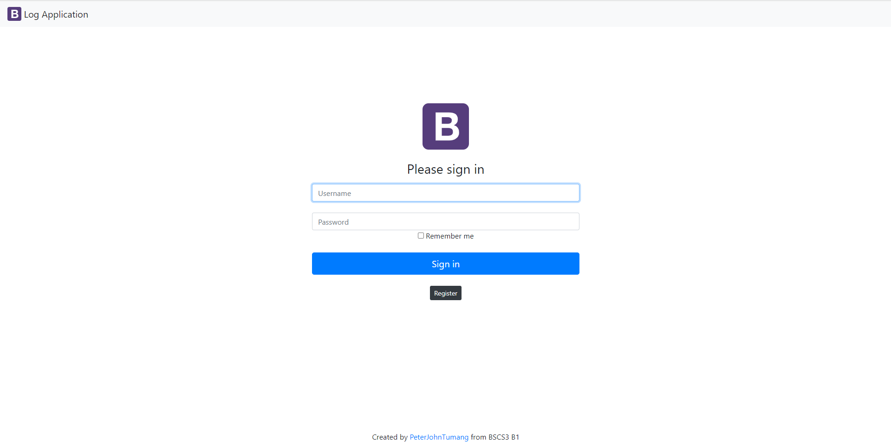

##### : This repo is from Practice Set 5-06

# logApp-scaling-octo

logApp-scalling-octo or _logApp_ is a sample application that registers an user's personal information such as Id, Last Name, First Name, and Address through its main _Index Page_. The user has to click the terms and conditions button to fully register his/her data. In the administrator's side, all the data that was inserted by the users can be seen in _Person's log_ including the date and time the user registers. Furthermore, the sample application has _Login Page_ to access _Person's log_ and view the information acquired from the registration through table. And lastly, the _Person's log_ has a _Logout_ button to exit the page.

 

## Visuals

### _Registration without content_

 

### _Registration with content_

 

### _Admin Login Page_

 

### _Admin Login Page with content_

 

### _Table of Data from Registration_

 

## Database Preparation

- Install Xampp Server and access phpMyAdmin.
- Change your Username and Password.
- Import mydb.sql provided on this repo in phpMyAdmin.
- Modify the config.php and db.php in folder _config_ by your username and password in phpMyAdmin.
- Feel free to edit the person and account table and its data.

 

## Authors

 

## &nbsp; &nbsp; &nbsp; &nbsp; &nbsp; &nbsp; &nbsp; &nbsp; &nbsp; &nbsp; &nbsp; &nbsp; &nbsp; _Peter John B. Tumang_
